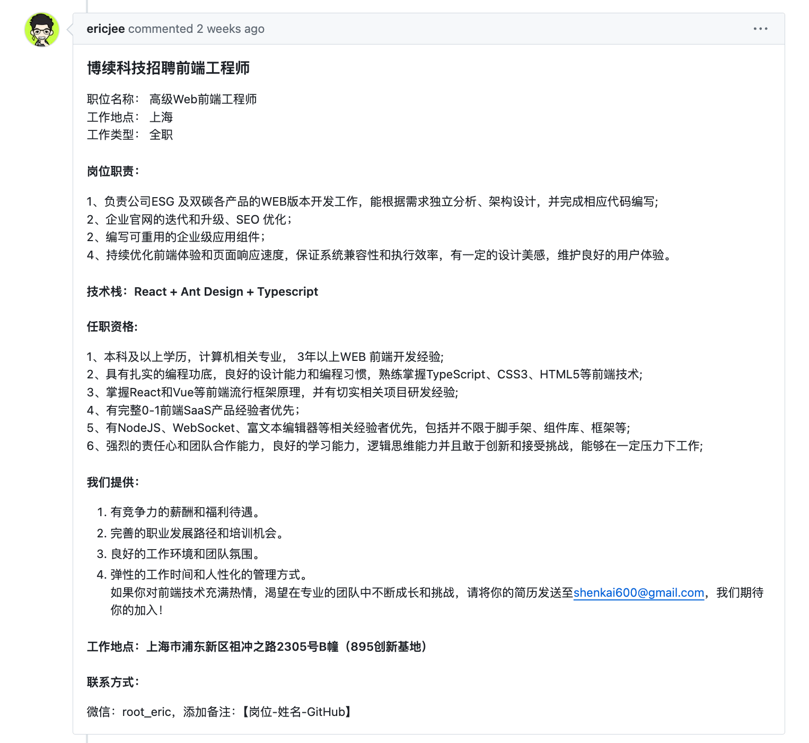
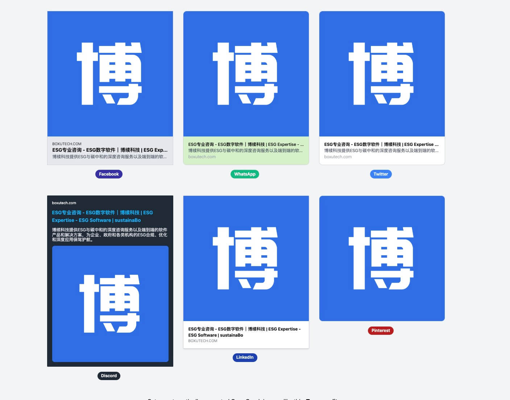
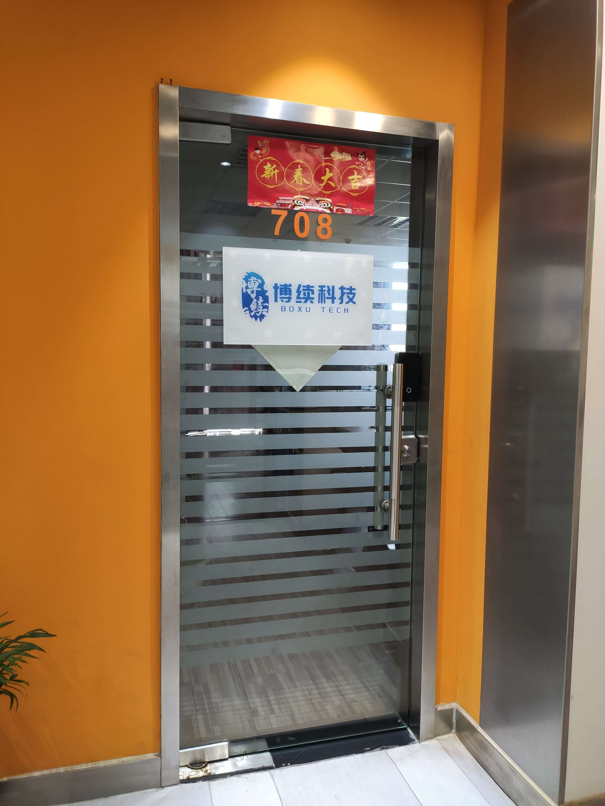
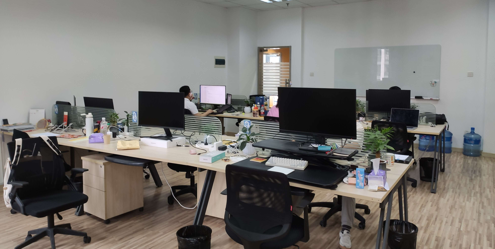

两周之前都晚上十来点了，突然收到一个消息，阮一峰老师的谁在招人专栏发布了一个招人的帖子——**博续科技招聘前端工程师**，打开一看技术要求和我上家几乎一模一样，立马投递，第二天就收到了面试。

> [来源-谁在招人](https://github.com/ruanyf/weekly/issues/4550#issuecomment-2173571463)

第一次面试问的问题很广泛但不是前端问的，一个后端的全栈面试端，主要偏向项目经历那些技术，如何做的等等。第一面过了，第二面既然和第一面面试官面的问题一模一样，非常好奇的再次解释了一遍，最后一面本来要线下，可能老板不在办公室改成线上了，我发腾讯会议老板还没用，非要用微信视频，整个面试过程下来很不正规，没有流程也没有人事跟流程，回消息也很慢，不过创业公司也难怪。

聊下来，感觉对方做的蓝海项目，挺好靠谱直接入职，最后结果还是很不错的，入职给的电脑是最新的 M3，待遇也还不错，也不用打卡。不过难度也是很大的，听同事讲上个前端是一个女生，呆了不久 hold 不住走了。确实挺难的，一个人既要做官网也要做后台管理，用的还是 Next.js。必须有过硬的技术，经得住考验的业务能力。如果不能满足这两个，要想留下来只能多花功夫，加点班用点心去做，现在不好找工作顶不住也要顶。

招人的描述真实性几乎 100%，没一点废话，全是刚性兑现，岗位职责没啥好说的，任职资格更没法有半点水货。平常入职第一天就装装环境可以了，后面有人带着熟悉熟悉项目框架，慢慢承担更多任务，但是小公司就没法这么办了，我工具还没配齐，直接就让拉代码（项目还没来得及熟悉）直接干活，修了官网十来个移动端兼容的问题 (https://boxutech.com/) 。不过就这一天也学了不少东西，也许之后有时间写个移动端开发小技巧这种文章。

今天入职的第二天，给官网配置了 Open Graph，学完就用只能有时间再回顾。

浦东张江附近的人真是太多了，用我女朋友的话来讲都是人肉味。

人多好处也是有的，就是路边有小摊，不愁买不到早餐，晚上也有一部分过来，杨浦就很少见了。

这两个建筑挺有意思的：

公司有一个独立办公室，两排桌子，会议室只能用共享的了。

中午的时候招我进来的后端请我去吃了羊蝎子，算是接风宴了😄。

这边附近的小碗菜还不错，价格和我之前的食堂一样，但是量比较多而且好吃。

上海 2024 年 07 月 02 日 22:56
