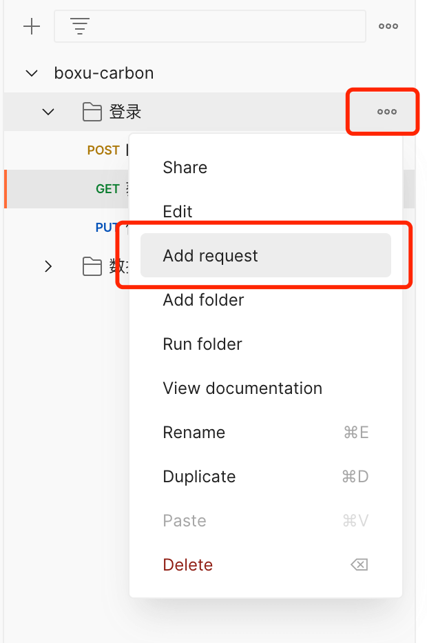
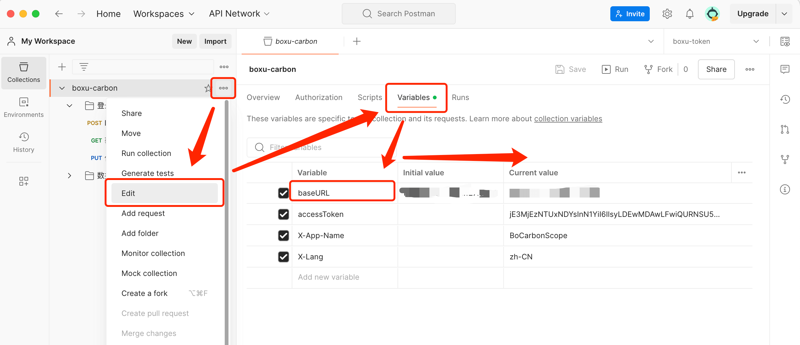

> 本文主要介绍前端使用 postman 的指南

## 起因

最近在开发一个项目，项目比较着急，后端开的接口也比较快，但是存在很多的 bug，需要前端 review 之后进行调整，不然开发一个功能再去对接口，遇到问题反馈到后端，一来一回这个流程就很费时间。

为了节约开发时间，则需要使用 postman 进行接口测试，但是发现没有使用使用 postman 的经验，于是就想着自己写一个。

## 准备工作

官网下 Postman，下载地址：[https://www.postman.com/](https://www.postman.com/)

## 开始使用

因为公司可能不止一个项目，所以先新建一个 collections，这样后续比较便于管理。

然后每个项目新建一个文件夹，点击右边三个点，选择 Add Folder，比如登录。

同样的操作在这个文件夹下新建一个 request。

## 设置环境变量

在 Postman 中设置环境变量，方便后续使用，比如 URL 的 的 baseURL，请求后端所携带的 accessToken，以及其他所需要的变量，比如当前系统的语言。

## 设置请求 token

在请求中设置请求头，携带 accessToken。注意我们如何引用变量的。

## 设置请求头

在请求中设置请求头，携带其他需要的参数，我们通过自定义预设来添加的，我新建了一个 common headers 预设。

## 一个请求

在请求中，设置请求的 URL，请求方式，请求头，请求参数，请求体。

点击，send，查看响应结果。

## 快速复制一个 request

## 最后

我们很容易快速建立一个测试项目，如下：

非常有用，节省了开发时间，感谢 Postman。

更多技巧，可以 Youtube 搜索 Postman，或者访问官网：[https://learning.postman.com/](https://learning.postman.com/)

> 2024 年 7 月 20 日
