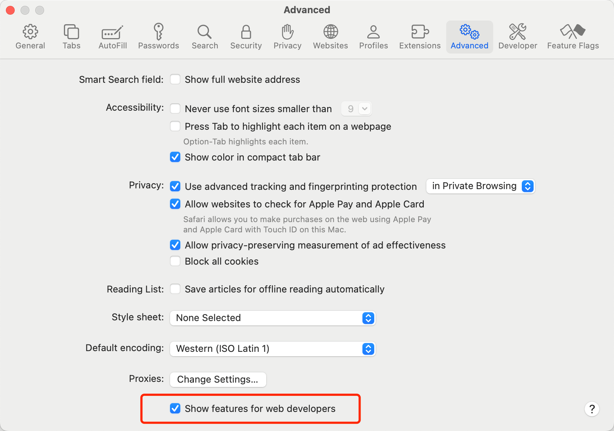
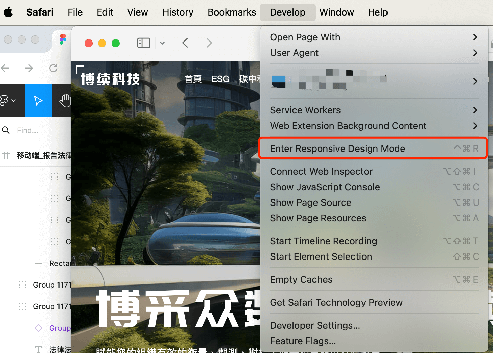
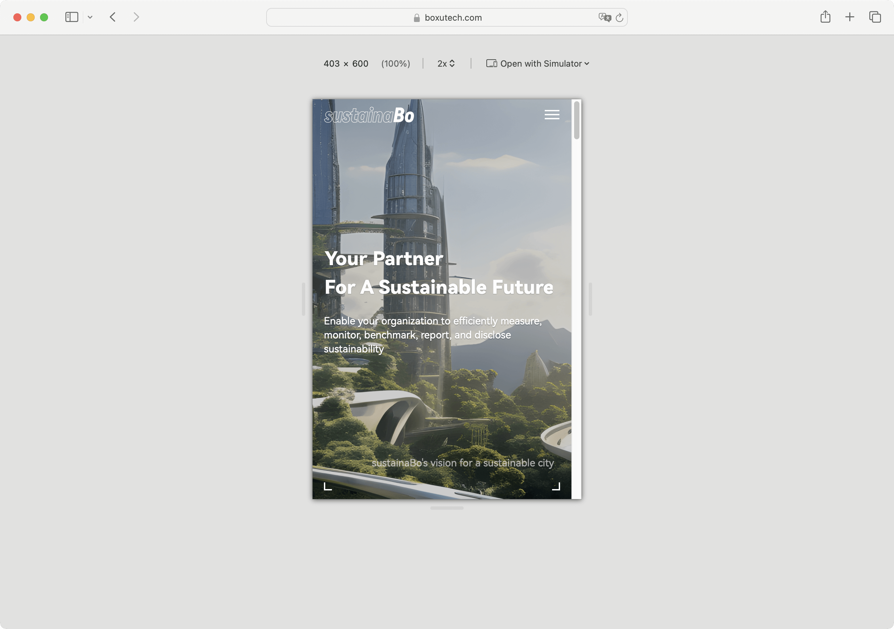
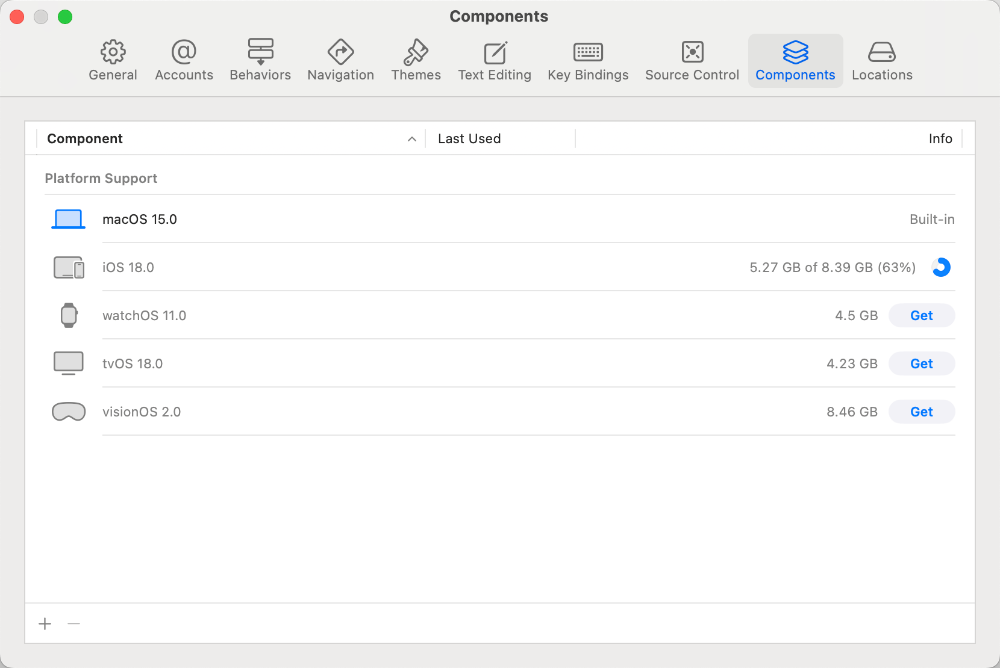
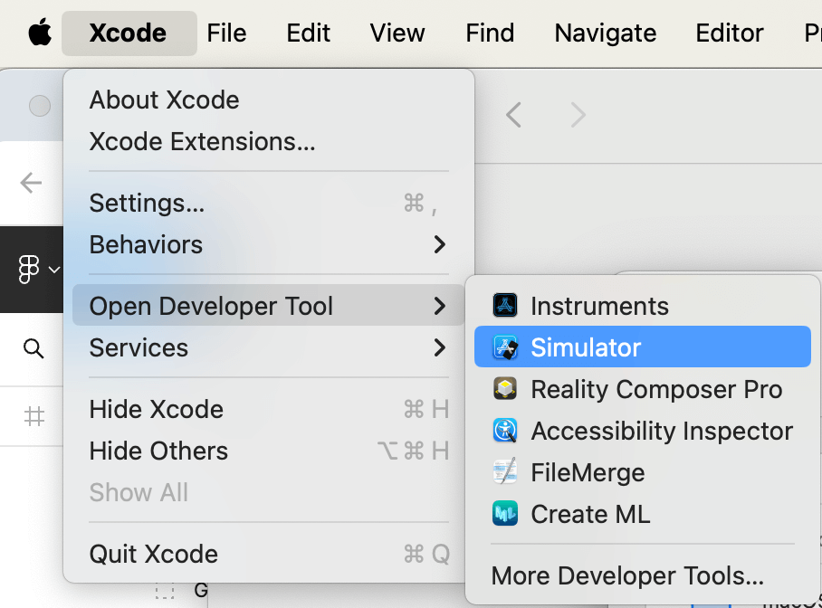
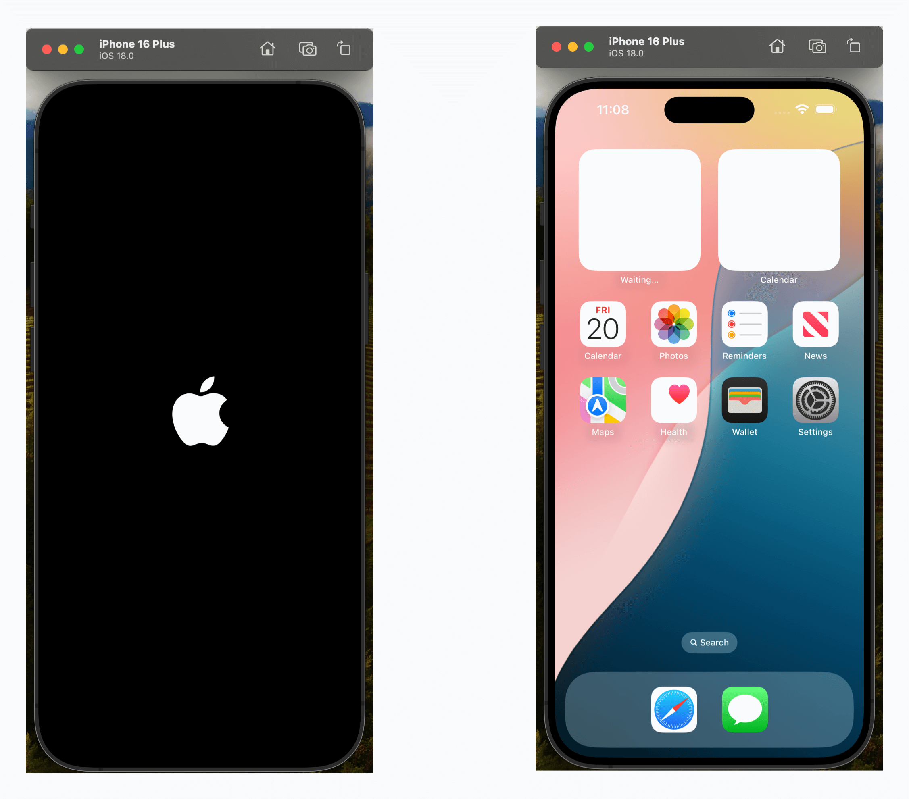

## 开启 Safari 浏览器开发者模式

打开 Safari 浏览器，点击菜单栏中的 `Safari` -> `settings` -> `advanced` -> 勾选 `Show Develop menu in menu bar`

## 进行移动端调试

点击菜单栏中的 `Develop` -> `Enter Responsive Design Mode` 即可进入移动端调试模式。

实际预览效果如下：

但是这个模式只能模拟移动端而已，本质还是 macOS 的 Safari，并不是 iOS 设备的 Safari，所以我们需要下载 XCode 进行真实的模拟。

## 下载 XCode

前往 Apple Store 下载 XCode，安装完成后即可使用。

## 下载 iOS 模拟器

打开 XCode，点击菜单栏中的 `Xcode` -> `Settings` -> `Components` -> 点击下载按钮即可下载 iOS 模拟器。

打开 XCode，点击菜单栏中的 `Xcode` -> `Open Developer Tool` -> `Simulator` 即可打开 iOS 模拟器。

漂亮的 iOS 模拟器就打开了：

## 真机调试

点击屏幕上的 Safari 图标，即可打开 Safari 浏览器。

