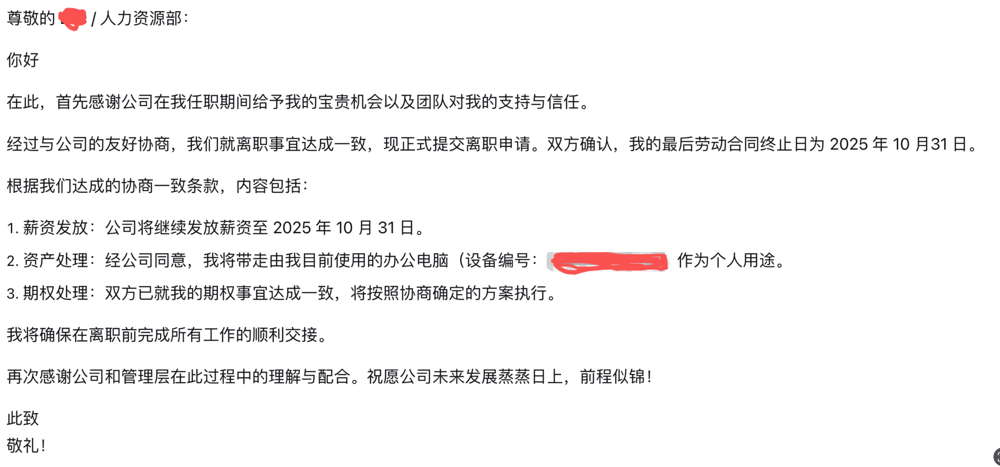
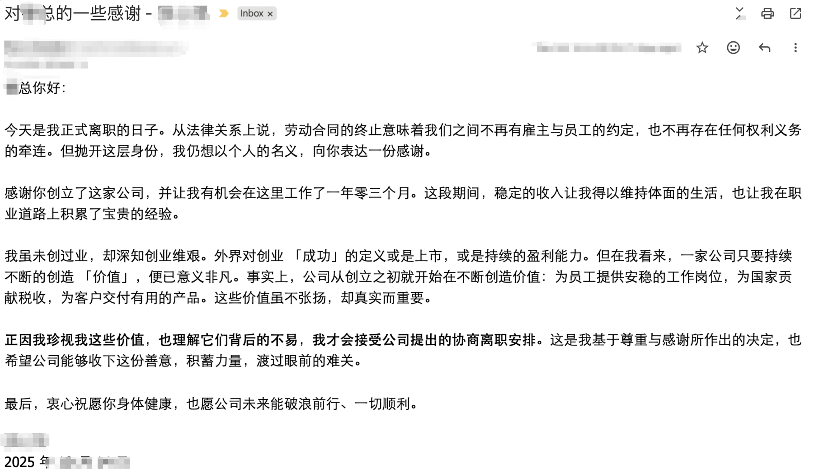
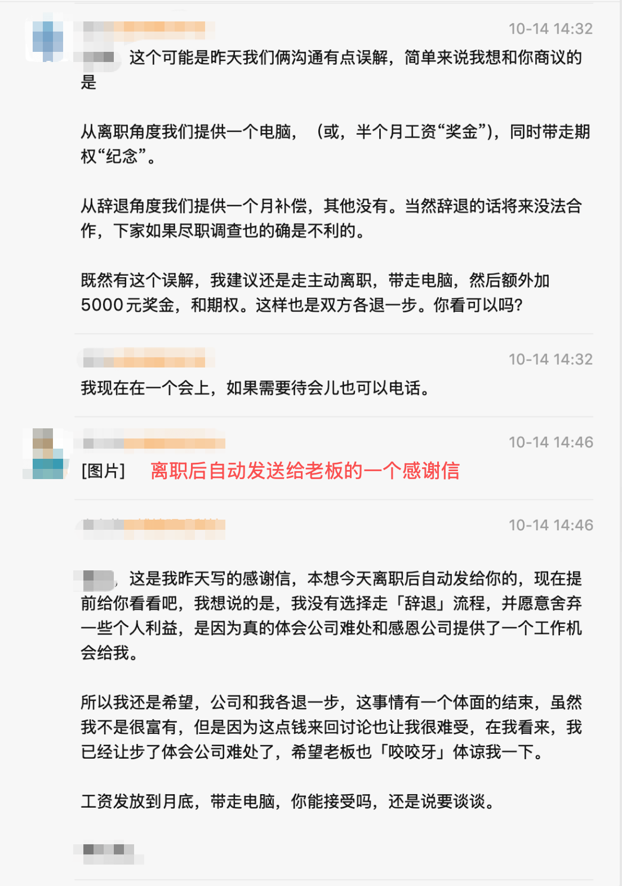

我在 2024 年 7 月 1 日入职了「博续科技」，到 2025 年 10 月 14 日离职，一共工作了 13 个月。

> 入职日记请看：[2024-07-01 入职「博续科技」](https://condorheroblog.github.io/posts/2024-07-02-new-company/)

国庆假期结束后，我回到公司开始新一周的工作。过了一个周末，周一早上，当初招我进来的领导满脸愁容，拎着电脑来上班。但这次他放下电脑后很快就出去了，大约三十秒后，我收到他的消息，让我去阳台一趟，说有事商量。看到消息，我就有不祥的预感——可能是公司经营出了问题。没想到还真是。

我笑着走到阳台，客气地和领导打了招呼。他看起来很疲惫，简单介绍了公司目前的状况：公司经营遇到困难，老板决定收缩团队，看能不能挺过这段时期，先活下去。如果是这样，我们的合作就告一段落，你工作到本周五，把手头的工作收尾并交接，工资发到周五，并赔偿一个月工资。领导说这只是他的建议，具体还要下午老板亲自和我谈。如果老板不同意给赔偿，就建议我「卖惨」，说现在工作不好找。（领导应该是想按 N+1 给我赔偿，但从他的暗示来看，老板并不愿意给。领导也无能为力，毕竟公司和钱都是老板的，他做不了主。后来确实是我和老板直接谈的。）

> 按照劳动法，这属于裁员，应赔付 N+1 个月的工资。N 是工作的年份数，不满半年按 0.5 计算。因此我应得的赔偿是 1.5 + 1 = 2.5 个月工资。**老板和我领导都算错了**。

对于被裁员，我表示理解，也接受了这个结果。之后和领导聊了聊公司业务发展的问题，在阳台没说完，我们又去楼下绕着园区走了两圈，谈到公司目前的困境，业务虽然领先，但市场需求可能要几年后才能爆发，以及现在招聘市场回暖，可能找工作会容易一些。

下午，老板找我谈话。他比较直接，给了我两个选择：

1. 「走裁员流程，公事公办，你去打官司，我也不一定给，以后也不用合作了」（注：这纯属扯谈，如果我去仲裁，他肯定得给，顶多费点时间，而且对他的影响肯定比对我大。）前面这句就是老板原话，我当时听了也很震惊，没想到老板是这样的人。如果这点钱能让公司活下去，我送给他都没问题，但关键是，公司开不下去肯定不是缺我这点钱。而且什么叫「以后不用合作了」？**法律是社会的底线，那笔赔偿是我应得的。难道不应该是你给了我应得的，我们才有合作的基础吗？** 被老板这么一说，好像我拿了该拿的，反而成了小人，不配和他这个「君子」做朋友了。我当场表示不同意，老板也开始诡辩，虽然说得天花乱坠，但毫无逻辑，我听了但没信。再争论下去就是价值观的问题了，没必要，我就没再继续。

2. 「保持合作的机会，两天交接完手头工作（老板认为再难的工作两天也够了，给我两天已经很多了），工资发到月底」。关于离职交接时间，他还举例说之前离职的同事都是当天通知、当天就走。我心里想，那些人要么是有工作失误，要么是考核不合格。我是一个正常员工，你辞退我，离职和辞退的标准能一样吗？虽然你是老板，但脑子也是一团浆糊，经常搞混逻辑，公司开不下去也正常，哈哈。当然这话我没说出口，原因很简单，之前和他谈为什么正常赔偿在他眼里成了「不正常要求」时，他的回答已经是诡辩了，再争只是浪费时间。

谈话过程中，还有一点让我特别不舒服。老板表面上说是为我考虑，语气里却带着威胁。他说，如果我走辞退流程，下家公司做背调时，他们可能不会说我的好话。他说到这点时，我已经回应说「这个不用你担心」，提示还算委婉了。但他太为自己的利益着想了，后面又略带威胁地提了好几次，我就没再接这话茬。这是一个老板该说的话吗？对别的员工也就算了，我还是比较明事理的，本来希望好聚好散，结果你还威胁我。

谈完这些，我又问了其他和我利益相关的问题，比如期权能不能兑换，老板拒绝了，看来 99% 是废纸了；年终奖能不能按比例发，毕竟我过去工作很认真，平时加班我就没要什么福利，五一还加了五天班什么也没要，老板也拒绝了。

谈话结束时，我想了个折中的办法：我明天就离开，工资发到月底，我现在用的电脑 MacBook Pro M3 2024 款让我直接带走，那 1.5 个月的赔偿我就不要了，这样总可以了吧？毕竟这台电脑我已经用了 13 个月，二手也不值什么钱了。但因为是租的，老板说要问问老板娘，之后再给我答复。我说没问题，如果这个方案你同意，那我吃点亏就算了。

晚上收到老板的消息，说电脑可以给我，服务商那边回复可以买下来。我回复说，明天处理一下。

笠日，老板娘让我写辞职信，我写了一封邮件并附上要求：工资发到月底，电脑带走。

结果老板娘发来一条消息，我整个人都懵了：她说工资只发到 14 号，电脑可以带走。我的天，这真是铁公鸡一毛不拔啊！辞退后无视劳动法也就算了，居然真的一点都不打算给。我当时正在给另一位同事写交接文档，立刻回复说现在没时间写，得先谈赔偿的事。

老板娘打电话过来，当时我很生气，语气非常强硬。我直接告诉她：N+1 不能少，如果你们坚持这样处理，那我就走辞退流程。老板娘说她接收到的老板信息可能有误。我说那我再和老板确认一下，于是又和老板来回沟通了一番。

整个过程和我拉扯的已经不是我入职的那个老板了，相对没有赔偿更加难受的是老板已经变了，法律要求你对员工的保障你绝对不能少，这是你的底线和责任。

最后的结果是：工资发到月底，电脑我带走。期权本来就是废纸，就折算成电脑。那 N+1 中 N 的赔偿，就当送个人情给老板了。

**虽然不满意老板的处理，但我表示理解，并报以同情，希望老板和公司都能发展的较好**。

聊天记录如下，剔除了一些隐私信息，我同意之后离职方案后没，老板娘立刻就把我移出了公司，这些截图，也是我和老板交流时，分享给我好朋友的时候偶然留下的（毕竟他很关心我，给他吃个瓜也是好的哈哈哈），我被移出后聊天记录都清空了，都没来得及群里通知下其他同事，平时合作的提前一天说了，剩下的就线下通知了：

聊天中打算离职后发给老板感谢信。

上海 2025 年 10 月 14 日 21:56
