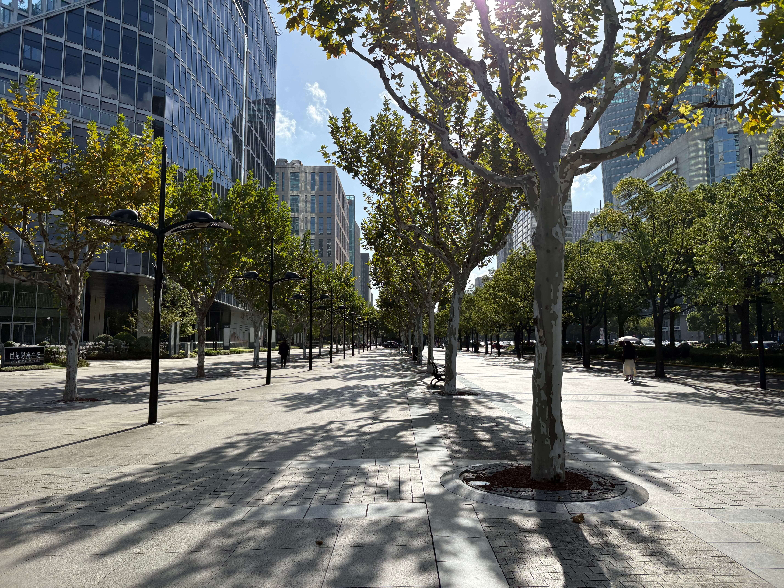
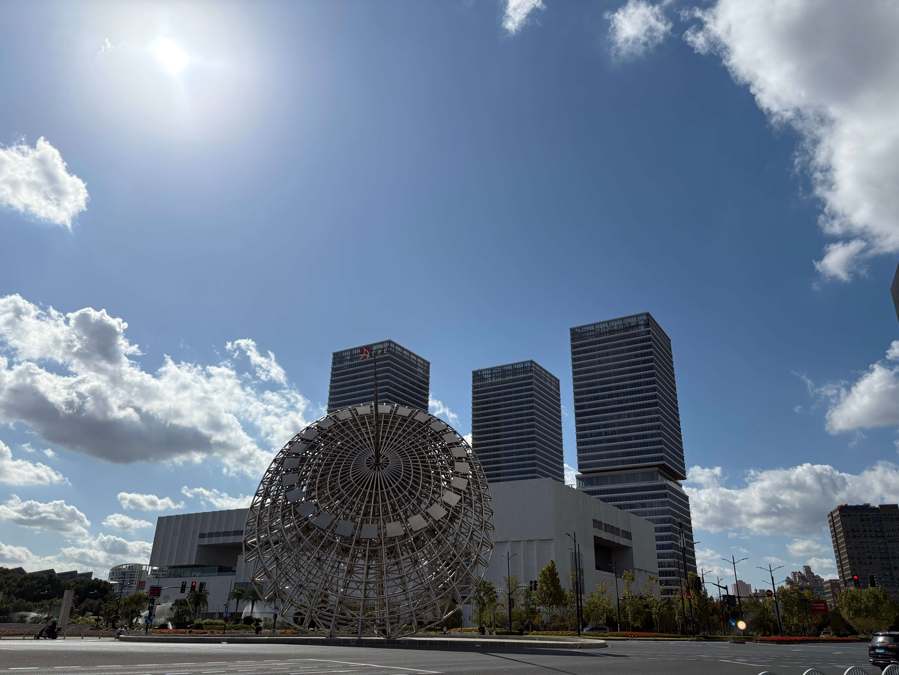
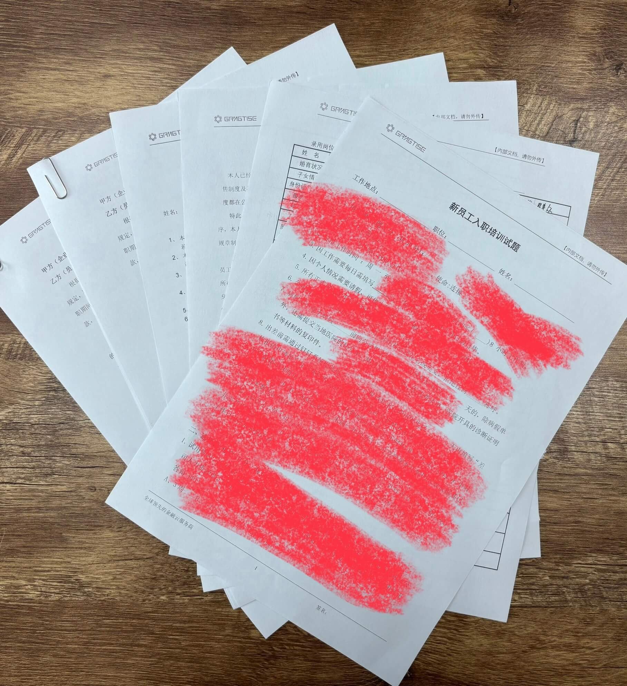
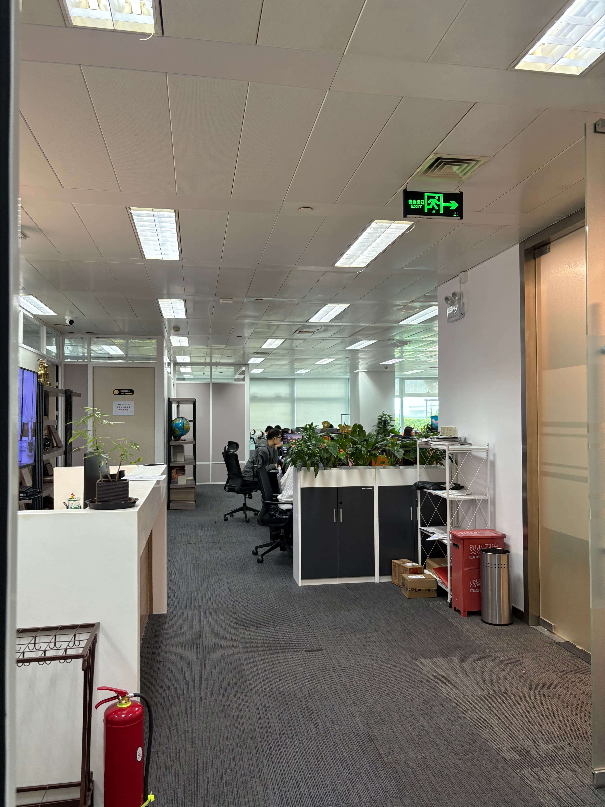
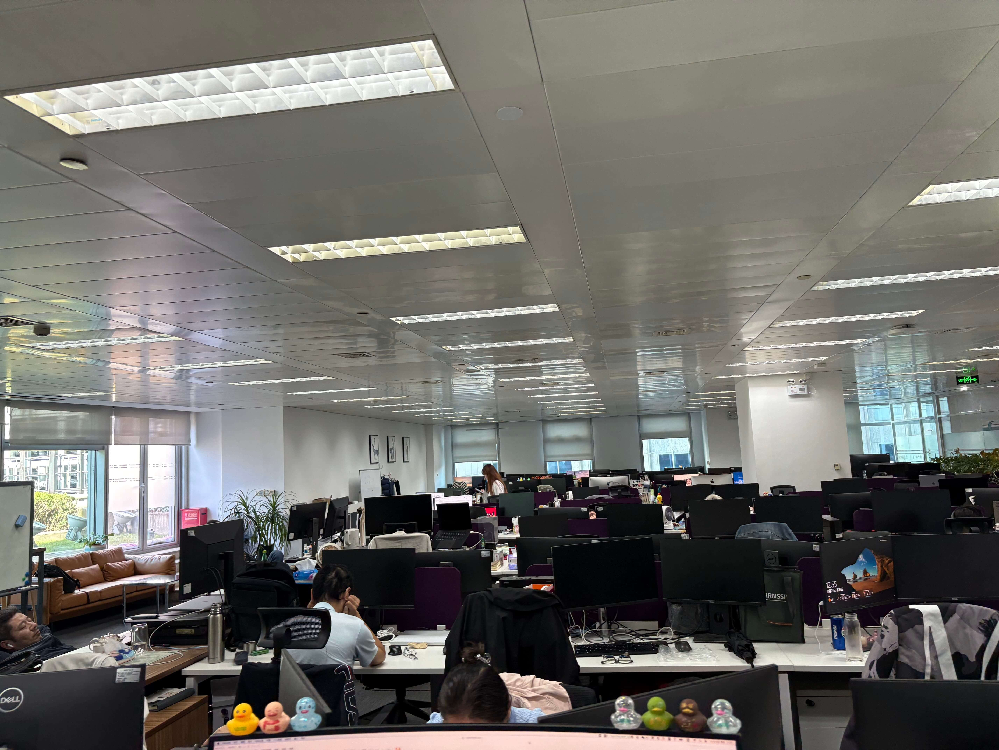
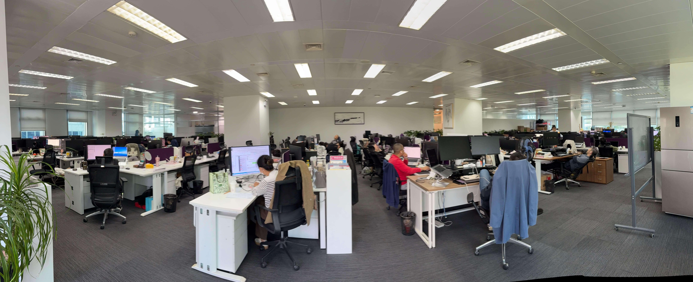
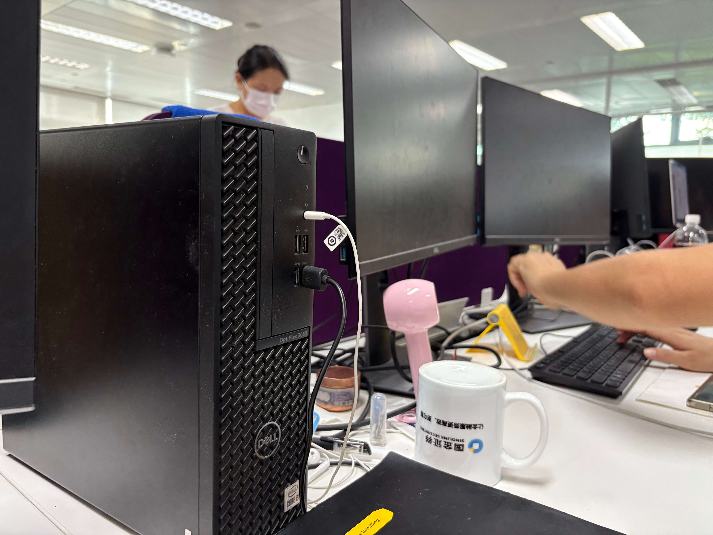
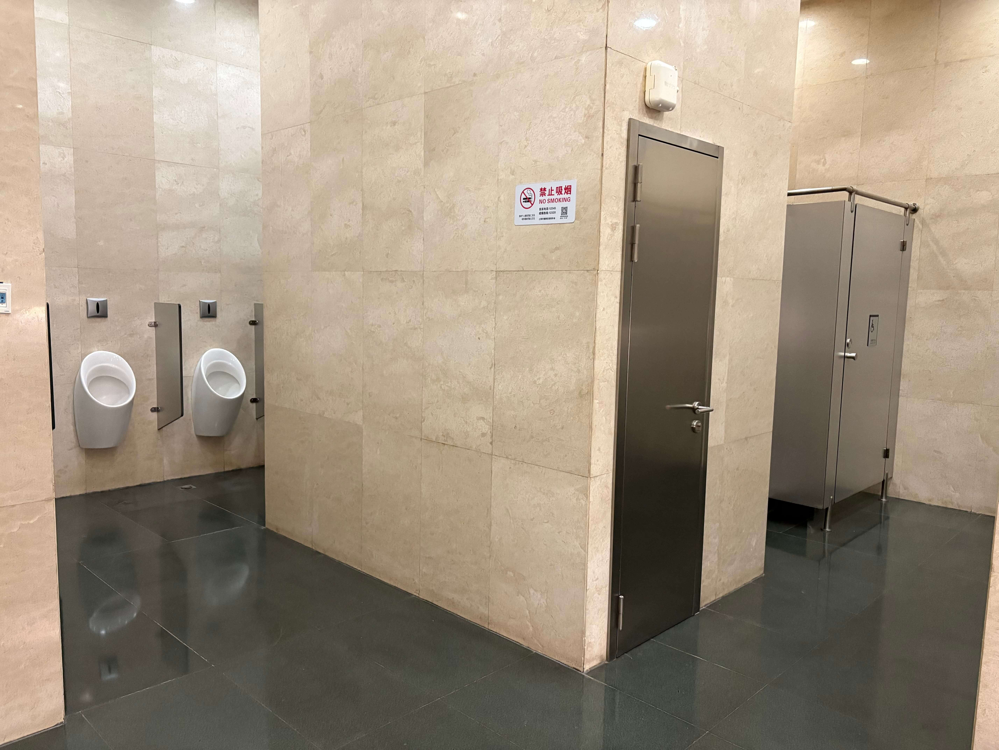
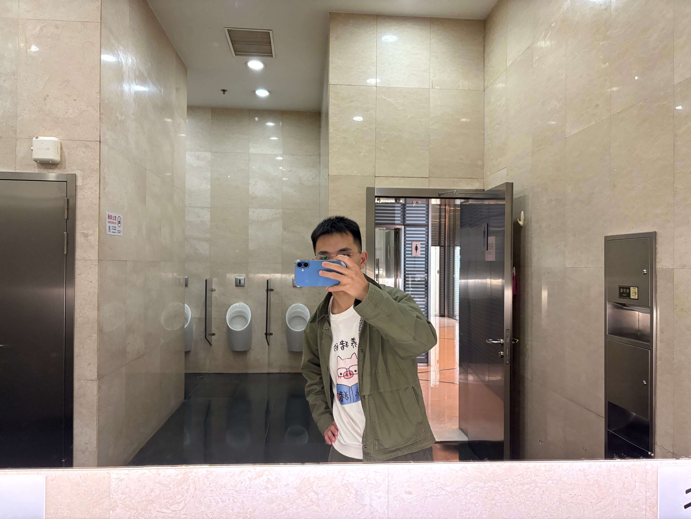

离职后，当月就找到了工作，感觉还是很不错的，最起码不用体检没有工作的痛苦，所以无论在这家公司干多久，都是很感谢的它的。

考虑到去年找工作不顺利，所以一接到 Offer 就立刻接受，先不考虑别的因素，比如公司的文化、工作环境、工作内容等。好的话继续干着不好的话就边干边找。

得有四五年没有在写字楼工作了，这次公司在写字楼，三个最显眼的缺点：环境小、厕所少、门禁刷卡。

早上公司的入职流程太麻烦了，需要手写很多东西，很多人现在都不写字了，提笔忘字可太难受了，明明有电子版还整纸质版，之前的公司合同和离职文件等全是电子签的，手机上提前填好，写一个名字就行了。

人事部和研发部是分开的，不得不说人事行政这边挺大的，典型的写字楼办公环境。

但是你看研发部的办公几乎背贴着背了，有任何人从后面走都需要动一动人家才能比较顺利的过去。

这边的办公电脑也全是 Windows 系统的，研发部不用 Mac 电脑，说实话 Windows 开发的软件就是不好看——丑，我是客户我都不买，不过现在软件好看的不好看的都卖不掉无所谓了，显示器的质量更差劲了哎。

需要刷门禁的问题我解决了，要不然每次都需要带着一个卡，直接把卡读取到我的小米手环了，方便不少兜里无卡自由了。

这边每层都有每个楼层的卡，无卡进不去别的楼层，这边每层厕所两个坑位，看看公司这么多人肯定是不够的，而且多人使用也没那么干净了，所以我都是去一楼，虽然那里也只有两个坑位，但是阿姨打扫的比较频繁，厕所小中午吃饭饭冲牙就是一个问题。

附近写字楼你没卡是进不去的，还好在我们楼附近有一个类似物业中间的地方，二楼可以无卡进去，那里厕所比较大，请看图片。

这边的其他福利用在这工作一年多的同事的话讲：一毛不拔。零食下午茶、纸巾全都都要自己买，我想要一个插板都没有多余的，还要我自己带，最受不了的入职体检需要自费，从来没有自费过。

这都是小事，不能干就走，也没有什么好抱怨的，只是想分享一下。

上海 2025 年 10 月 24 日 21:51
